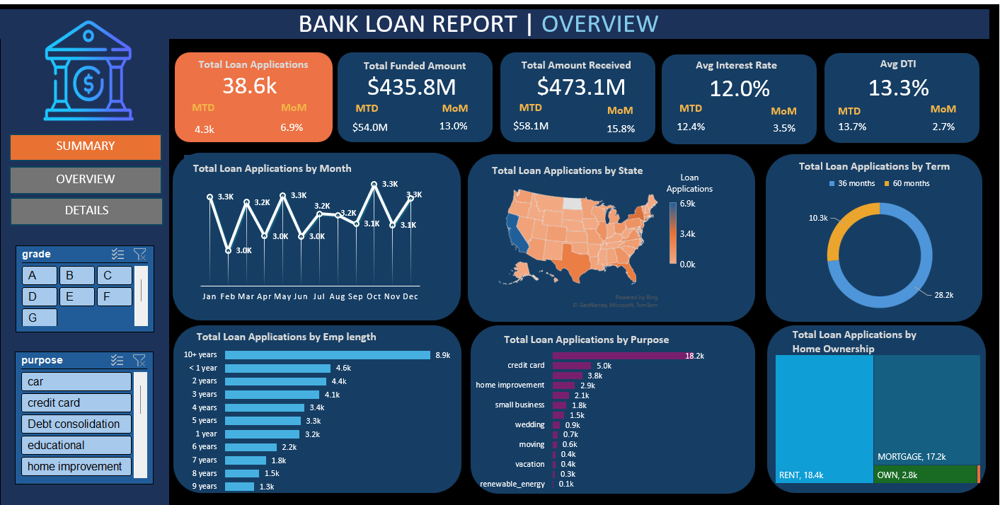
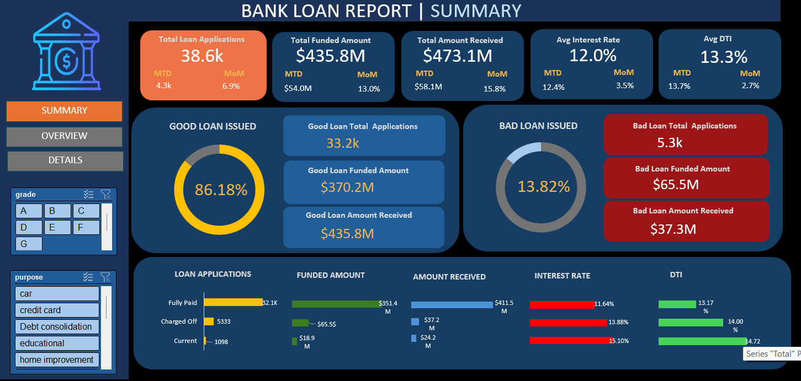

# Financial Dashboard using Microsoft Excel

This project is an interactive Excel dashboard created for financial data analysis and reporting.

The dashboard includes:
- sales analysis
- profit analysis
- KPI tracking
- interactive charts
- slicers and filters

---

## Tools Used
- Microsoft Excel
- Pivot Tables
- Pivot Charts
- Slicers
- Conditional Formatting

---

## Dashboard Features
- KPI cards
- Sales trend analysis
- Product/category analysis
- Interactive filtering
- Dynamic charts

---

## Dashboard Screenshots

### Overview Dashboard

### Summary Dashboard

---

## Files Included
- Excel dashboard file (.xlsx)
- Dashboard screenshots

---

## Learning Outcome
This project helped improve my understanding of:
- dashboard design
- data analysis in Excel
- pivot tables and charts
- interactive reporting

---

## Author
Amulya